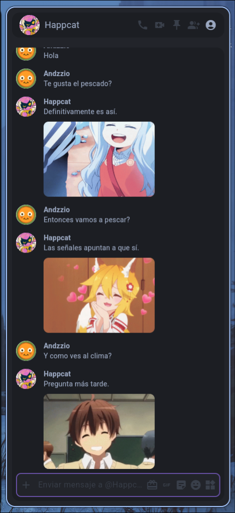
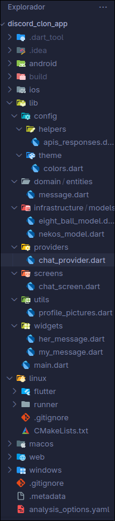

# 🎮 Discord Clone App - With "Happcat" Bot

Welcome to my Discord clone! 🚀

This is a **Flutter** practice project designed to replicate Discord's "Dark Mode" chat interface and implement custom bot logic.
The goal was to build a clean and organized structure from scratch, figuring out the business logic and UI/UX design on my own.

---

## 📸 Project Previews

### 💬 Chat Interface


_The interface replicates Discord's visual style, including avatars, message bubbles, and color palette._

### 📂 Project Structure


_Organized folder structure for better code management._

---

## ✨ Features

- **Discord-like Design**: Colors, fonts, and spacing adjusted to mimic the Discord "Dark Mode" experience.
- **"Happcat" Bot 😸**: An interactive bot that responds to your messages.
  - **Text Responses**: Uses the [Magic 8-Ball API](https://www.eightballapi.com/) to provide yes/no answers or mystic advice.
  - **Visual Reactions**: Uses the [Nekos API](https://nekos.best/) to send random anime images along with the text.
- **State Management**: Implemented with **Provider** to handle the message list and UI updates reactively.
- **HTTP Requests**: Uses the **Dio** package for robust API handling.

---

## 📂 Project Organization

I organized the project folders intuitively to keep the code clean, modular, and easy to navigate:

- **`domain/`**: Contains core entities (like `Message`) that define what the app handles.
- **`infrastructure/`**: Handles data models for parsing JSON responses from the APIs (`NekosModel`, `EightBallModel`).
- **`config/`**: Global configurations such as the theme (`theme/colors.dart`) and API helpers.
- **`providers/`**: State logic (`ChatProvider`) that connects the UI with the business logic.
- **`screens/` & `widgets/`**: Separated visual components for better reusability.

---

## 🛠️ Technologies Used

- **Flutter & Dart**
- **Provider** (State Management)
- **Dio** (Networking)

## 🚀 How to run

1.  Clone the repository.
2.  Install dependencies:
    ```bash
    flutter pub get
    ```
3.  Run the project:
    ```bash
    flutter run
    ```
